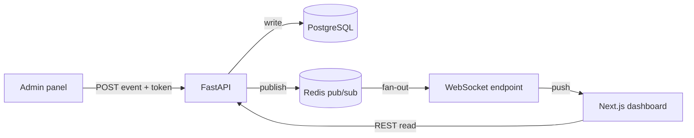
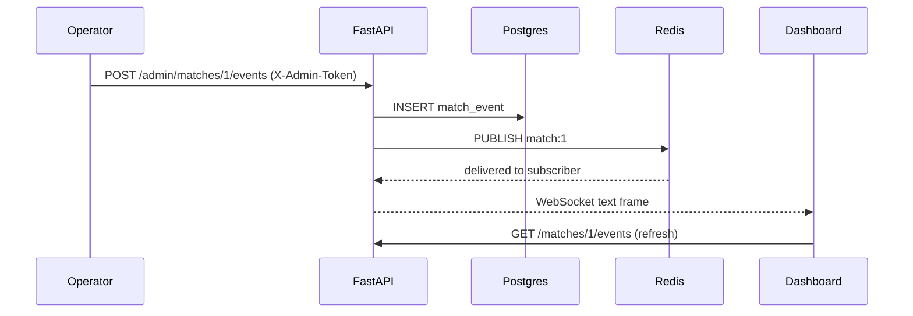

# Architecture

This document explains how the pieces fit together and why the boundaries are
drawn where they are.

## High-level flow

## Why this shape

The write path and the read path are intentionally separate. Writes go through
the token-protected admin router, land in Postgres, and then announce themselves
on a Redis channel. Reads are plain REST. Live updates are a third path over a
WebSocket that simply forwards Redis messages to the browser.

Keeping these three concerns apart means the dashboard never blocks on a write,
and the analytics code never needs to know whether it is serving a historical
match or a live one.

## Request lifecycle for a live event

## Module boundaries

- `app/routers` only deals with HTTP concerns and delegates everything else.
- `app/services/analytics.py` is pure: events in, dicts out. No DB, no FastAPI.
- `app/services/events_bus.py` is the only module that knows about Redis.
- `app/models` holds the SQLAlchemy ORM definitions and nothing else.

This is what makes the analytics layer trivially testable: the unit tests build
plain fake event objects and never touch a database.

## Failure modes I thought about

- Redis down: the bus falls back to a no-op and the WebSocket sends an info
  frame so the client knows live push is disabled. REST still works.
- Bad admin token: the admin dependency raises 401 before any write.
- Unknown match id: routers return 404 instead of leaking a 500.

## What I would add for production

A message broker with delivery guarantees instead of fire-and-forget pub/sub,
Alembic migrations, per-operator auth, and a cache in front of the analytics
endpoints for large historical archives.
