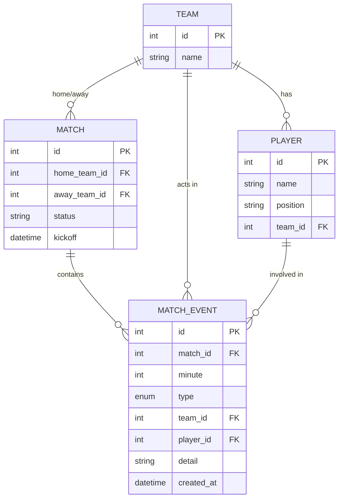

# Database schema

Four tables. Tables are created from the SQLAlchemy models on startup
(`Base.metadata.create_all`). There is no migration tool yet — see the
roadmap.

## Tables

**teams** — one row per club. `name` is unique.

**players** — belongs to a team via `team_id`. `position` is free text
(for example `ST`, `CB`, `GK`).

**matches** — references two teams. `status` is one of `scheduled`, `live`,
or `finished`.

**match_events** — the heart of the model. Every goal, shot, card, sub, and
possession snapshot is one row. `type` is an enum; `detail` is a flexible text
field used for things like a scorer name or a possession percentage.

## Design notes

I kept events in a single wide-ish table rather than one table per event type.
The analytics layer branches on `type`, which keeps the schema simple and makes
it easy to add a new event type without a migration. The tradeoff is that some
columns (`player_id`, `detail`) are nullable because they only apply to certain
event types.

Possession is modelled as discrete snapshot events rather than a continuous
series. That is a deliberate simplification; a real product would likely store
a time series and interpolate.
