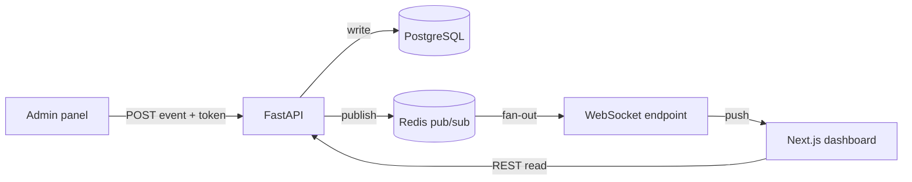

# Test line one
## Test line two

```js
const x = {a:1};
```
# Matchday Intelligence Platform

A real-time football match intelligence platform. You feed it raw match events
(goals, shots, cards, substitutions, possession snapshots) and it turns them
into a live dashboard, a momentum chart, per-team analytics, and an exportable
post-match report.

I built this to practice the parts of full-stack work I find most interesting:
modelling a messy real-world domain, pushing updates to clients over WebSockets,
and keeping the analytics layer pure and testable so it does not depend on the
database or the web framework.

> Status: early-stage portfolio project. It runs end-to-end locally via Docker
> Compose with seeded sample data. It is **not** deployed anywhere and has no
> real users — see "Honest limitations" below.

## What it does

- Live match dashboard that updates as new events arrive
- Admin panel to push match events (token-protected)
- Match timeline of every event in order
- Goals, assists, yellow/red cards, substitutions
- Possession tracking, shots and shots on target
- Momentum chart derived from weighted attacking events
- Per-team summary (goals, shots, cards, possession)
- Post-match report generator with a social-summary string
- Historical match archive (any seeded/finished match stays queryable)
- WebSocket live updates backed by Redis pub/sub

## Architecture at a glance



The analytics layer (`app/services/analytics.py`) is deliberately a pure
module: it takes an iterable of events and returns plain dicts. It never touches
the DB or FastAPI, which is why its unit tests run with zero infrastructure.

## Tech stack and why

- **FastAPI** — typed request/response models via Pydantic, first-class async
  for the WebSocket endpoint, and tiny boilerplate.
- **PostgreSQL + SQLAlchemy** — the domain is relational (teams have players,
  matches have ordered events). Foreign keys keep it honest.
- **Redis pub/sub** — decouples "an event was written" from "notify N connected
  clients". The bus degrades gracefully to a no-op if Redis is down so unit
  tests and quick local runs do not require it.
- **Next.js** — pages for the match dashboard, admin, and archive; easy client
  WebSocket wiring.
- **Docker Compose** — one command brings up db, redis, api, and web.

## Getting started

Requirements: Docker + Docker Compose. (For running pieces outside Docker you
also need Python 3.12 and Node 20.)

```bash
cp .env.example .env          # then edit ADMIN_API_TOKEN
docker compose up --build     # db, redis, api (:8000), web (:3000)
```

Seed the demo data (in a second terminal):

```bash
docker compose exec api python -m app.seed
```

Open http://localhost:3000 and click into the seeded match.

## Demo workflow

1. Seed the DB (command above) — this creates two teams and one finished match.
2. Open the match page to see the timeline, summary, and momentum chart.
3. Open `/admin`, paste your `ADMIN_API_TOKEN`, and add a live event.
4. Watch the match page update over the WebSocket without a refresh.
5. Hit the report endpoint to get the post-match markdown + social summary.

## API examples

```bash
# list matches
curl http://localhost:8000/matches

# analytics for match 1
curl http://localhost:8000/matches/1/analytics

# add an event (admin token required)
curl -X POST http://localhost:8000/admin/matches/1/events   -H "Content-Type: application/json"   -H "X-Admin-Token: $ADMIN_API_TOKEN"   -d '{"minute": 90, "type": "goal", "team_id": 1, "detail": "A. Mensah"}'

# post-match report
curl http://localhost:8000/matches/1/report
```

Full reference: [API_DOCS.md](API_DOCS.md).

## Testing

```bash
cd apps/api
pip install -r requirements.txt
pytest ../../tests/api -v
```

The analytics tests run without a database. CI also boots a Postgres service to
exercise the DB-backed routes (see `.github/workflows/ci.yml`).

## Honest limitations

- No authentication beyond a single shared admin token. Real multi-user auth is
  on the roadmap.
- Possession is stored as discrete snapshot events, not a continuous time series.
- The momentum chart uses a simple weighted-event model, not an xG model.
- No migrations tool yet — tables are created from the SQLAlchemy models on boot.
- Not deployed; no real traffic, no horizontal scaling story yet.

## Tradeoffs and decisions

- **Pure analytics module over DB-side aggregation.** Easier to unit test and
  reason about; the tradeoff is recomputation on each request, which is fine at
  this scale but would need caching for large archives.
- **Redis degrades to no-op.** Keeps the dev/test loop fast; the tradeoff is
  that live push silently disables if Redis is missing (the WS sends an info
  message so it is observable).
- **create_all instead of migrations.** Faster to start; I would add Alembic
  before any schema change in a shared environment.

## Roadmap and interview notes

See [ROADMAP.md](ROADMAP.md) for ten concrete next issues and
[INTERVIEW_NOTES.md](INTERVIEW_NOTES.md) for the questions I expect to be asked
about this design.
